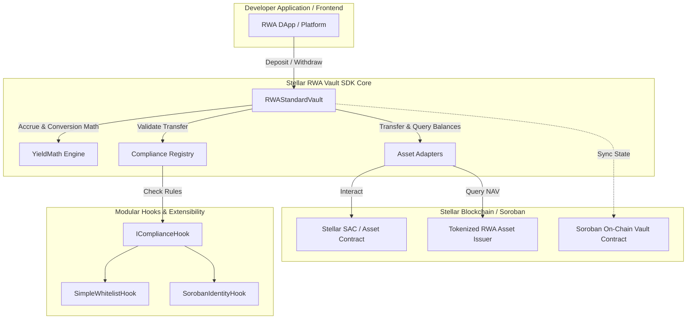
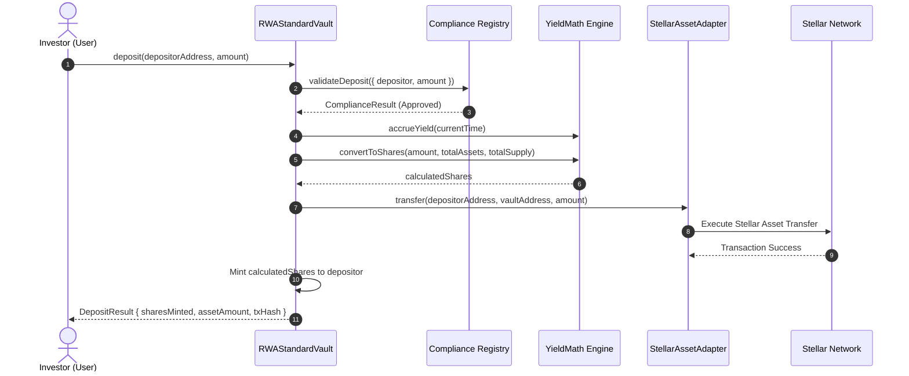

# System Architecture Specification (`architecture.md`)
## Stellar RWA Vault SDK

---

### 1. High-Level System Architecture



---

### 2. Component Design & Interfaces

#### 2.1 Core Vault Module (`src/core/vault.ts`)
- **`RWAStandardVault`**: The main operational class representing a vault instance.
- **Responsibilities**:
  - Manages total underlying assets and minted shares.
  - Controls lifecycle of deposit and withdrawal execution.
  - Coordinates precision conversion between underlying assets (e.g. USDC) and vault shares (e.g. `rwaUSDC`).
  - Triggers compliance hooks before approving transfers.

#### 2.2 Yield Accounting Math (`src/math/yield.ts`)
- **`YieldMath`**: High-precision fixed-point math calculator.
- **Precision**: Uses `BigNumber.js` configured with 18 decimal places for calculations, rounding down for share mints and rounding down for asset withdrawals to safeguard vault solvency.
- **Formulas**:
  $$\text{Shares Minted} = \begin{cases} \text{Amount}, & \text{if } \text{TotalShares} = 0 \text{ or } \text{TotalAssets} = 0 \\ \lfloor \frac{\text{Amount} \times \text{TotalShares}}{\text{TotalAssets}} \rfloor, & \text{otherwise} \end{cases}$$
  $$\text{Assets Returned} = \lfloor \frac{\text{Shares} \times \text{TotalAssets}}{\text{TotalShares}} \rfloor$$
  $$\text{Accrued Yield} = \text{Principal} \times \text{APY} \times \frac{\Delta t}{\text{Seconds Per Year}}$$

#### 2.3 Modular Compliance Hooks (`src/compliance/whitelist-hook.ts`)
- **`IComplianceHook` Interface**:
  ```typescript
  export interface IComplianceHook {
    name: string;
    validateDeposit(context: DepositContext): Promise<ComplianceResult>;
    validateWithdraw(context: WithdrawContext): Promise<ComplianceResult>;
  }
  ```
- **`SimpleWhitelistHook`**: Checks sender and receiver account status against an authorized list of verified investors (KYC/AML status, jurisdiction status).

#### 2.4 Asset Adapters (`src/adapters/stellar-asset.ts`)
- **`IAssetAdapter` Interface**:
  ```typescript
  export interface IAssetAdapter {
    assetCode: string;
    issuer: string;
    decimals: number;
    getBalance(address: string): Promise<bigint>;
    transfer(from: string, to: string, amount: bigint): Promise<boolean>;
  }
  ```
- **`StellarAssetAdapter`**: Adapter for Stellar SEP-41 SAC tokens (e.g. USDC, EURC).

---

### 3. Execution Data Flows

#### 3.1 Deposit Execution Flow



---

### 4. Project Directory Structure

```
stellar-rwa-vault-sdk/
├── PRD.md
├── architecture.md
├── package.json
├── tsconfig.json
├── jest.config.js
├── drips-wave-issues.md
├── src/
│   ├── index.ts                  # Public SDK entrypoint
│   ├── types/
│   │   └── index.ts              # Interface definitions & types
│   ├── utils/
│   │   └── validation.ts         # Zod schemas & input sanitization
│   ├── math/
│   │   └── yield.ts              # Yield & ERC-4626 share conversion math
│   ├── compliance/
│   │   └── whitelist-hook.ts     # IComplianceHook & Whitelist enforcement
│   ├── adapters/
│   │   └── stellar-asset.ts      # IAssetAdapter & Stellar SAC adapter
│   └── core/
│       └── vault.ts              # RWAStandardVault implementation
├── tests/
│   ├── vault.test.ts             # Vault deposit/withdraw & share tests
│   ├── yield.test.ts             # Precision math & compounding yield tests
│   └── compliance.test.ts        # Whitelist & compliance validation tests
└── examples/
    └── basic-vault-demo.ts       # Executable end-to-end demo script
```
